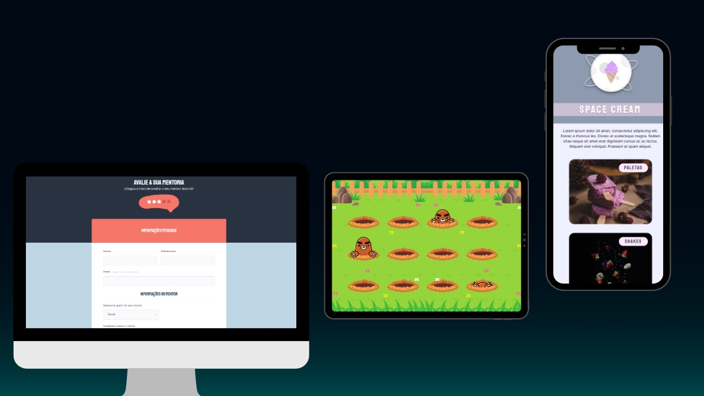

<h1 align="center">Study Project Library</h1>

Repository developed to publish study projects, created to be used as a library for development and study.  

  

 

  

 

## 🚀 Technologies

This repository uses these technologies:

 HTML e CSS 
 Git e Github 
 Figma 
 Javascript

 

## 💻 Projects

This repository has several projects using various technologies such as HTML, CSS, Javascript and has as its purpose the study and development of each of these.

 

## 📝  License

This project is under the MIT license.

