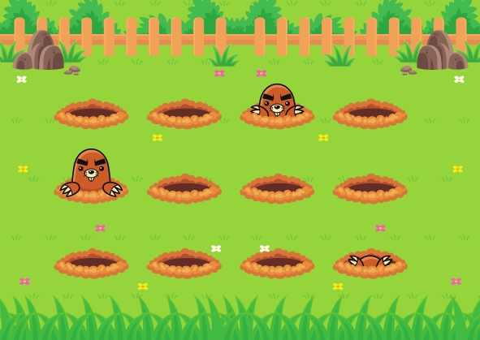

<h1 align="center"> Whack a Mole</h1>

Projeto desenvolvido com o Programa exclusivo promovido pela Rocketseat para ensino de tecnologias WEB.  

  

 

  

 

## 🚀 Tecnologias

Esse projeto foi desenvolvido com as seguintes tecnologias:

 HTML e CSS 
 Git e Github 
 Figma 

 

## 💻 Projeto

O Whack a Mole é uma ilustração animada.

 

## 📝  Licença

Esse projeto está sob a licença MIT.

---

 

Feito com ♥ by Rocketseat   [Participe da nossa comunidade!](https://discord.gg/rocketseat) 